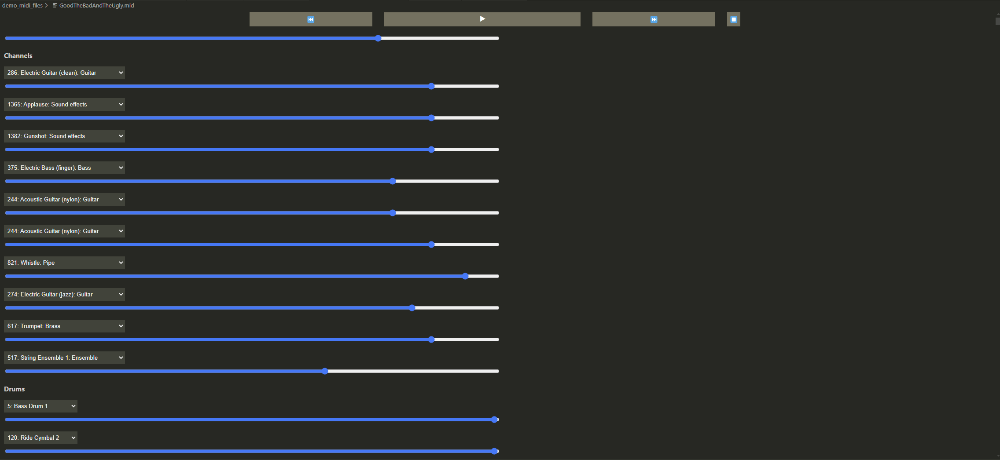

# Midi File Player 

## About

This is a quick VSCode extension that allows you to "play" and view the contents of .mid midi files in VSCode

## Usage 
I haven't bothered to upload this to the VScode store thing yet, I might later. For now you can just open this repo in VSCode and then right click on the .visix file and you should see an install dialouge.

Afterwards you can open some of the files in `demo_midi_files` and play around with them.

## Next Steps/Shortcomings
- Currently you must be connected to the internet for this to work
- Unsure of how compatiable this is
- The json output is really weird (pitch vs note, etc.)
- You cant actually edit the document

